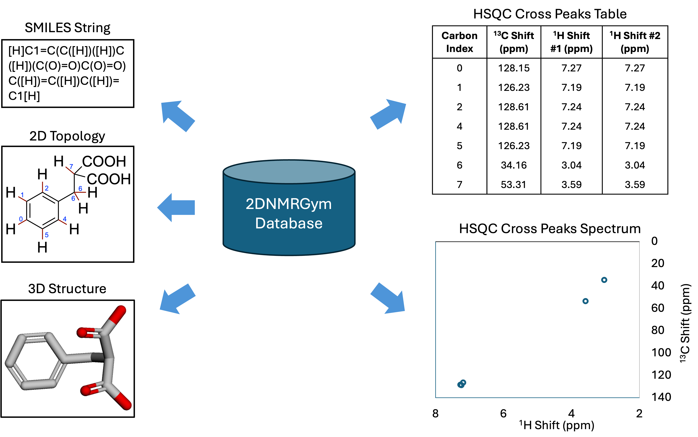

# Mol2DNMR
Official code and data of paper: Mol2DNMR: An Annotated Experimental Dataset for Advancing Molecular Representation Learning in 2D NMR Analysis.

The dataset contains ~20,000 molecules with their molecular graphs, SMILES strings, and the cross peak locations in the HSQC spectrum. The csv file, `all_annotations.csv` is a list of all molecules included.




## Requirements and Installation
### 1. Create Virtual Environment
```
conda create -n nmr python=3.9 
conda activate nmr
```

### 2. Install dependencies
```
pip install torch==1.13.1+cu117 torchvision==0.14.1+cu117 torchaudio==0.13.1 --extra-index-url https://download.pytorch.org/whl/cu117
pip install torch-geometric==1.6.3 torch-sparse==0.6.9 torch-scatter==2.0.7 -f https://data.pytorch.org/whl/torch_stable.html
pip install pytorch_lightning 
pip install pandas 
pip install matplotlib
pip install numpy
pip intall pickle5
conda install -c conda-forge rdkit
pip intall argparse
```
## Usage
### Training the Model
The pipeline is set up for 5 GNN models for representation learning: GCN, GIN, GAT, ComENet, SchNet. To use other models, you can simply add the GNN encoder to the `/models` directory. The GNN encoder class should return the node representations.

Three bash files are provided: run.sh for 2D GNN models, run_schenet.sh for SchNet, run_comenet.sh for ComENet. 

To train the model, run either: 
```
python main.py --batch_size 64 --type gin --hidden_channels 512 --num_layers 5 --c_sol_emb_dim 32 --h_sol_emb_dim 16
```

or 
```
sbatch run.sh 64 gin 512 5 32 16
```

### Evaluating the Model 
To evaluate the model, run either: 
```
python eval_model.py 
```

or 
```
sbatch eval.sh
```
This file evaluates all the checkpoints in a provided folder, and create a csv file to record all MAE results. 

## Baseline Models
5 models are tested on Mol2DNMR dataset, they are listed below  along with their publication year and links to the related papers.

| Name      | Year | Related Paper                                         |
|-----------|------|-------------------------------------------------------|
| GCN       | 2017 | [Semi-supervised Classification with Graph Convolutional Networks](https://arxiv.org/pdf/1609.02907)        |
| GIN       | 2018 | [How Powerful Are Graph Neural Networks](https://arxiv.org/pdf/1810.00826)          |
| GAT       | 2017 | [Graph Attention Networks](https://arxiv.org/pdf/1710.10903)          |
| ComENet   | 2022 | [ComENet: Towards Complete and Efficient Message Passing for 3D Molecular Graphs](https://arxiv.org/pdf/2206.08515)          |
| SchNet    | 2018 | [SchNet - a deep learning architecture for molecules and materials](https://arxiv.org/pdf/1712.06113)          |


